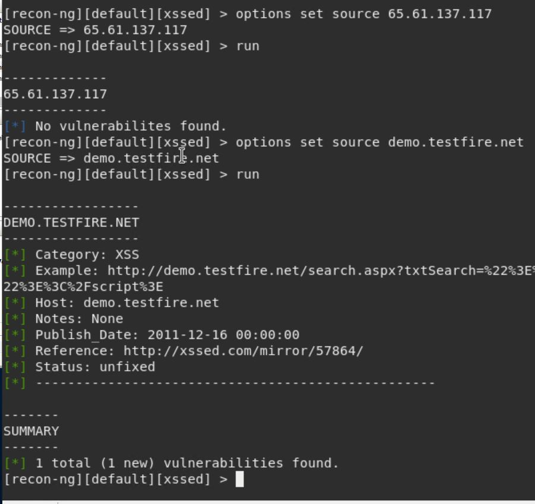

### Week 16 Homework Submission File: Penetration Testing 1

#### Step 1: Google Dorking

- Using Google, can you identify who the Chief Executive Officer of Altoro Mutual is: <b>Karl Fitzgerald</b>

- How can this information be helpful to an attacker: <b>This is a starting point for a hacker or inflitrator to begin data mining the target.</b>

 

#### Step 2: DNS and Domain Discovery

Enter the IP address for `demo.testfire.net` into Domain Dossier and answer the following questions based on the results:

  1. Where is the company located:  
<b>City: Sunnyvale 
StateProv: CA 
PostalCode: 94085 
Country: US </b>

  2. What is the NetRange IP address:   <b> NetRange:    65.61.137.64 - 65.61.137.127</b>

  3. What is the company they use to store their infrastructure: <b> CustName: Rackspace Backbone Engineering </b>

  4. What is the IP address of the DNS server:
   <b>117.137.61.65 </b>

#### Step 3: Shodan

- What open ports and running services did Shodan find:
<b> - 80
 - 443
 - 8080
  All of the ports are using Apache-Coyote/1.1</b>  

#### Step 4: Recon-ng

- Install the Recon module `xssed`. 
- Set the source to `demo.testfire.net`. 
- Run the module. 

Is Altoro Mutual vulnerable to XSS: <b> Yes it is </b>

### Step 5: Zenmap

Your client has asked that you help identify any vulnerabilities with their file-sharing server. Using the Metasploitable machine to act as your client's server, complete the following:

- Command for Zenmap to run a service scan against the Metasploitable machine:  <b> nmap 192.168.0.10 -sV</b>
 
- Bonus command to output results into a new text file named `zenmapscan.txt`:  <b>nmap 192.168.0.10 -sV > zenmapsscan.txt</b>

- Zenmap vulnerability script command:  <b> nmap -- script smb-enum-shares,smb-vuln-ms17-101 192.168.0.10</b> 

- Once you have identified this vulnerability, answer the following questions for your client:
  1. What is the vulnerability: <b>Samab (SMB) - SMB Shares Enumeration and possibly Microsoft SMBv1 to a remote code execution vulnerability (ms17-010, a.k.a. EternalBlue).</b>

  2. Why is it dangerous:  <b>The vulnerability is actively exploited by WannaCry and Petya ransomware and other malware. TCP Port 139 is one of the highest-risk ports on the network and you may need to disable the port 139 to avoid the WannaCry ransomware attack. If the computer supports both NBT protocol and the TCP/IP protocol, the NetBIOS session will start via the available 139 port or 445 port.</b>

  3. What mitigation strategies can you recommendations for the client to protect their server:  <b>
   It's recommended that you disable NetBIOS over TCP/IP on your cluster network NIC and other dedicated-purpose NICs, such as for iSCSI and Live Migration. NetBIOS isn't used in Server 2008 R2 clusters.</b>

